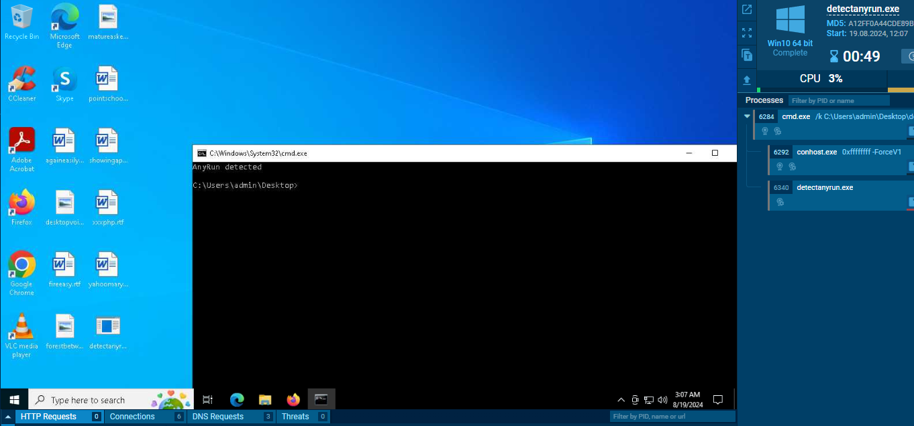

# ANY.RUN Sandbox Detection #1

- Part 1: The symblic device name of the driver.
- Part 2: The non-standard filesystem behaviour under protected ANY.RUN installed files and folders.

Part <u>3</u>: Coming Soon

### Irrelevant Glossaries

- The ANY.RUN components are under `%ProgramFiles%\\KernelLogger`.
- The usermode agent (a Windows service) is registered as `aga` with binary path `%ProgramFiles%\\KernelLogger\\aga.exe`.
- The virtual machine runs in a test signing mode.
  - ANY.RUN driver `A3E64E55_fl_x64.sys` is signed by WDK test certificate [attached here](./WDKTestCert%20SYSTEM,133087515274835630.cer).
- The macshift embedded in the ANY.RUN package spoofs MAC address but it is still able to obtain the original *permanent* MAC address by calling out the NDIS driver.
- The hypervisor presense bit in the CPU indicates is not present.
